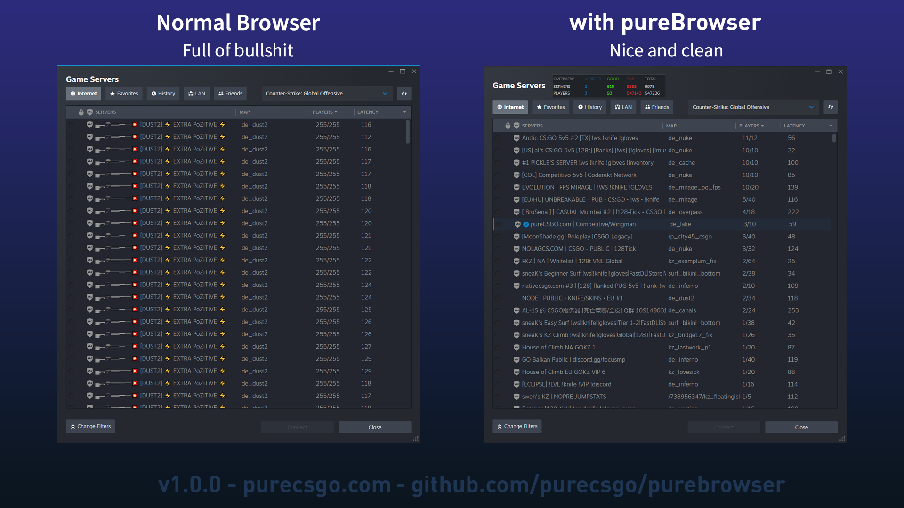
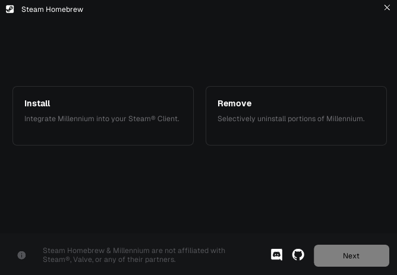
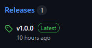
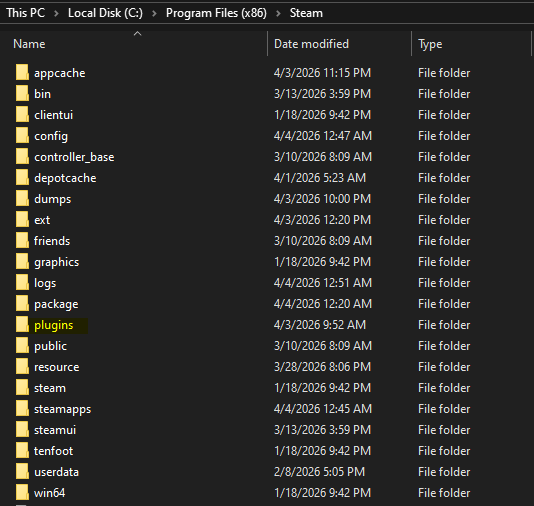
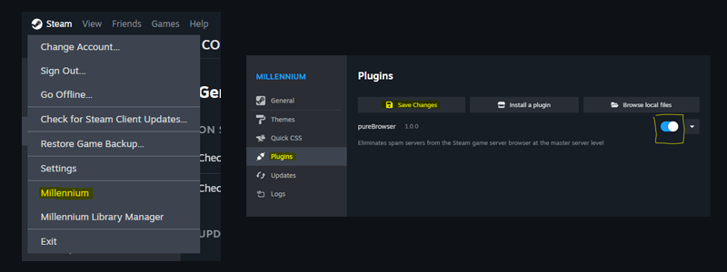
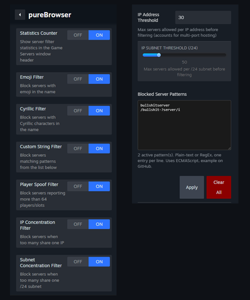
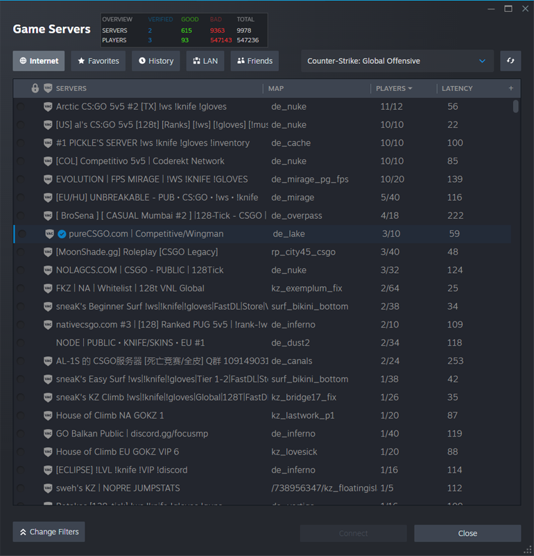

# pureBrowser
   
**Remove spam game servers easily within Steam!**

> NOTE: This plugin needs [Millennium (SteamBrew)](https://steambrew.app/), a Steam framework commonly used for themes but also supports frontend/backend plugins 



Anyone who has played CS:GO on the new app ID has seen the large influx of bullshit servers making it impossible to find legit servers to play on. The community has developed some third-party browser websites to avoid this. This project stands apart as it targets the spam directly within the Steam client using an [open-source plugin](https://github.com/pureCSGO/purebrowser/tree/main/frontend).

**LINKS**  
For help with Millennium: https://discord.gg/NcNMP6r2Cw

For help with this plugin: https://discord.gg/TgS7jV7A3r

We also offer our own gameservers with an upcoming in-depth rankings and statistics system: [https://purecsgo.com](https://purecsgo.com)


## HOW IT WORKS  
The plugin uses JavaScript to hook into SteamClient.ServerBrowser and processes each onServer callback during CreateServerListRequest. Each server is ran thru a series of checks which can be configured to your liking. The server is removed once it triggers a single check. Below is a breakdown of the current checks implemented and their hit rates. When used in conjunction, spam essentially disappears.

* Emoji hostname - \~7500/9999 (75%)
* Cyrillic hostname - \~6500/9999 (65%)
* User-defined hostnames\* - \~7500/9999 (75%)
* Player spoofing\*\* - \~5000/9999 (50%)
* IP concentration\*\*\* - \~7000/9999 (70%)
* Subnet concentration\*\*\* - \~6000/9999 (60%)

LEGIT: **\~1000 servers**

\*Using [blocklist](https://github.com/pureCSGO/purebrowser/blob/main/docs/blocklist.txt) targeting specific words, paste into plugin configuration

\*\*Servers with more than 64 players (the engine limit for CS:GO)

\*\*\*Using threshold of 30 servers/IP and 50 servers/subnet

**NOTES**  
- Keep in mind this is in **active development**, I just felt the current version is useful to others. Please report any issues.
- The master server will return a maximum of 9999 servers. This means that if enough spam is present and are queried first, legit servers could be missed. The normal browser is already vulnerable to this, we just attempt to mitigate it. A low-level solution is in the works for a future update. 
- Due to the large amount of themes, the statistics counter was built for the default Steam UI. It can be toggled off if it conflicts with your theme. It does not affect functionality.


## INSTALLATION
> 5-10 minutes to install, very simple

1. Download and install [Millennium (SteamBrew)](https://streambrew.app) if not already


2. Download the latest version of the plugin from the 'Releases' section


3. Extract the ZIP and copy contents to Millennium plugins folder (likely at ```C:\Program Files (x86)\Steam\plugins```)


4. Restart Steam and then navigate in the top left to Steam > Millennium. Within the Millennium menu, navigate to 'Plugins' and enable 'pureBrowser'. Click 'Save changes' and then reload Steam.


5. To configure the plugin, use the dropdown button and click 'Configure'. By default, all checks are enabled. Paste this [blocklist](https://github.com/pureCSGO/purebrowser/blob/main/docs/blocklist.txt) into the 'Blocked Server Patterns' or create your own.


6. Go to View > Game Servers. You should see a 'pureBrowser loaded' header. Refresh listings to see it in action.

